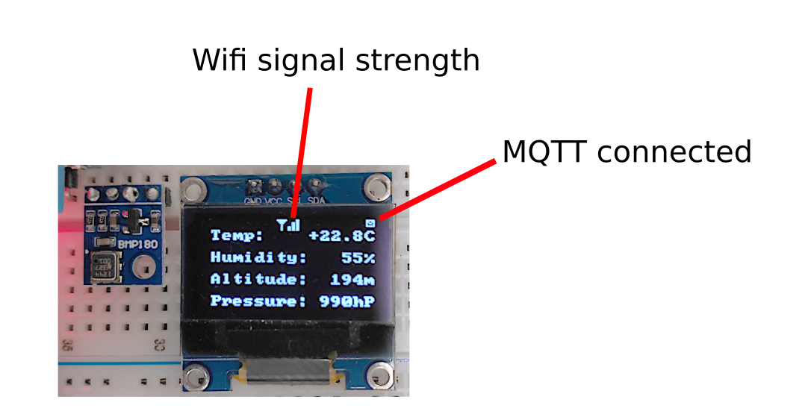
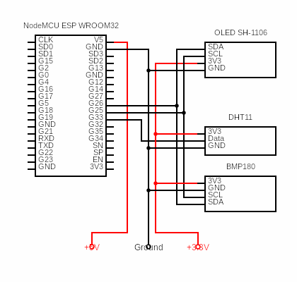
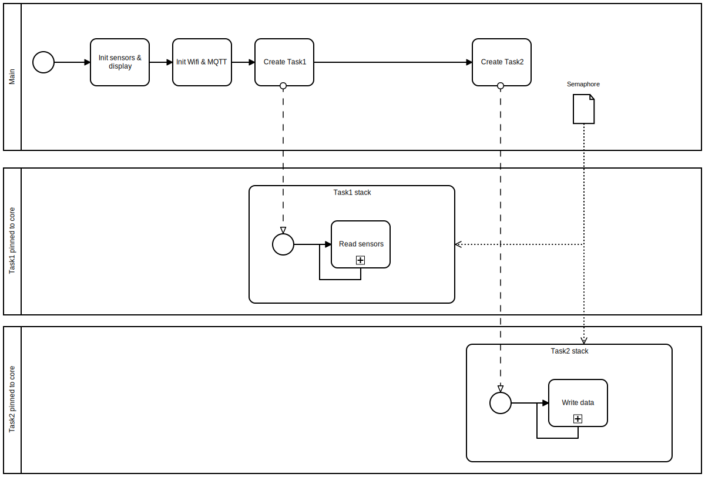

## ESP32 Tiny Weather Station

This project uses inexpensive components to build a small weather station. The MCU consists of an ESP32 WROOM32. DHT11 and BMP180 are used as sensors. The display is a cheap SH1106 OLED. All sensor data are transmitted to a MQTT server.
You do not need all components to run the application.
For example, you can configure the weather station without display or without the humidity sensor.
The project uses the esp-idf tool V4.3 with support files for the Espressif Visual Studio Code extension.

The application uses a FreeRTOS task implementation to read the sensor data and to output the data via serial interface, MQTT and display.

### SH1106 OLED Display

### Circuit Diagram

### Software Diagram

